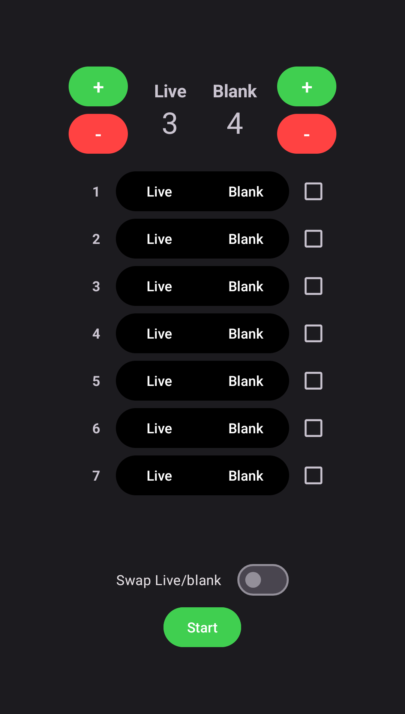

# Buckshot Counter
A simple counter/notes app for [Buckshot Roulette](https://store.steampowered.com/app/2835570/Buckshot_Roulette/). 
> [!NOTE]
> I've made this app for Singleplayer, I would advise against using it in multiplayer as it may be seen as foul play!

# Installation
1. Download the `app-release.apk` from the [latest release](https://github.com/duisterethomas/buckshot-counter/releases/latest).
2. Install `app-release.apk`

# Usage
### Starting screen
1. Set the amount of live and blank shells using the `+` and `-` buttons.
2. Tap `Start`.

### Game screen
- When a shell has been shot or ejected in game, tap the corresponing `Shot` button.
  - For example: A live round has been shot, tap the red `Shot` button.
  - Note: `Shot` taps are permanent, you cannot undo a shot.
- If you know what a future shell is going to be, just tap the corresponding button in the list of shells.
  - For example: You use a burner phone which tells you "Seventh shell ... blank round", then in row 7 tap `Blank`.
  - Note: Taps in the shell rows aren't permanent, you can deselect a shell by tapping on it again.
- When the round ends, tap `Reset` and repeat the steps.

Starting screen|Game screen
-|-
|
